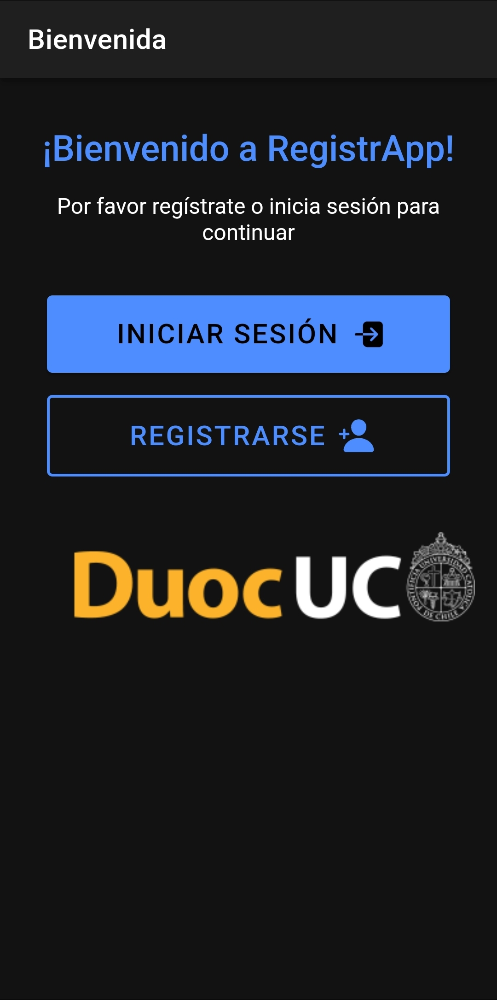
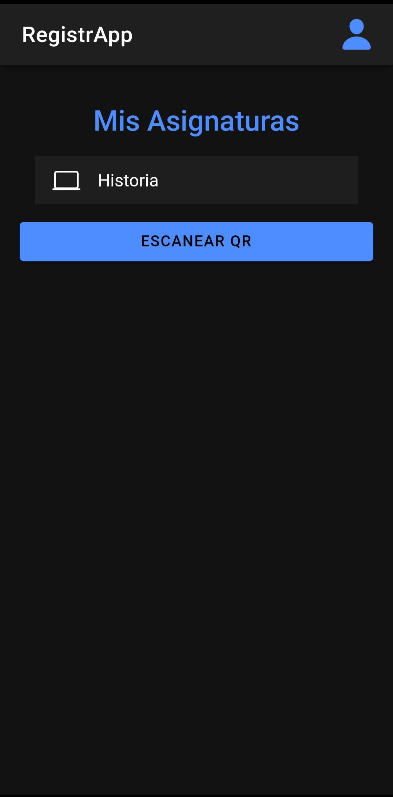
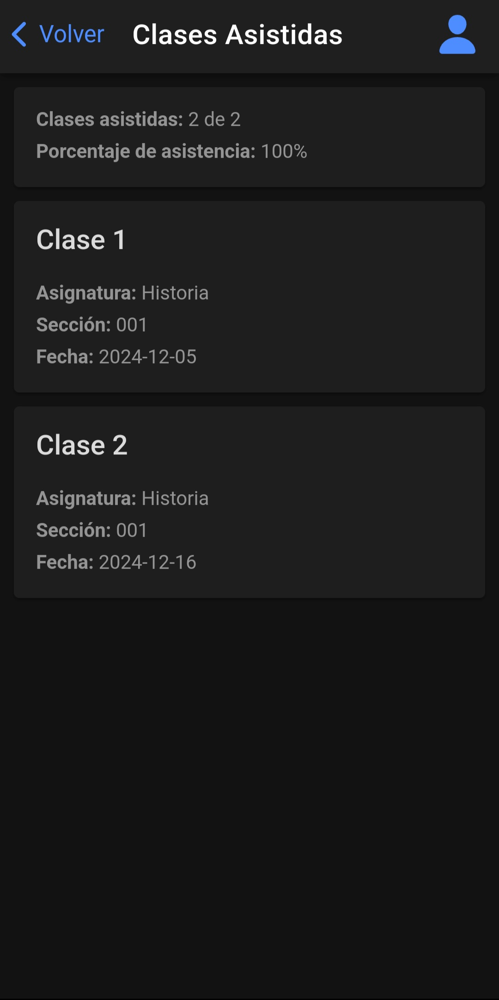
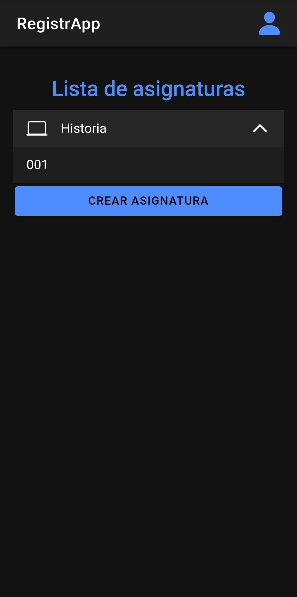
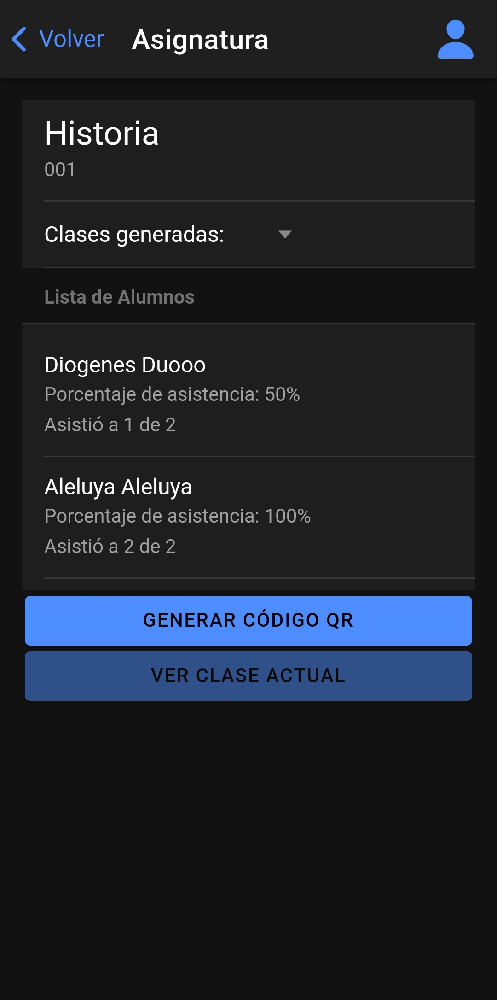

# Registrapp
Registrapp es una aplicación móvil que permite a los estudiantes registrar su asistencia escaneando un código QR generado por el docente mejorando la eficiencia en la toma de asistencia.

## Principales Características
- **Registro Automático de Asistencia:** Los estudiantes registran su asistencia escaneando un código QR mostrado por el docente durante la clase.
- **Inicio de Sesión Seguro:** El acceso a la aplicación se realiza mediante una cuenta creada por un estudiante.
- **Compatibilidad con Múltiples Dispositivos:** La aplicación funciona en teléfonos y tabletas con sistemas operativos Android e iOS, garantizando una experiencia fluida.
- **Interfaz Adaptativa:** Diseñada para ajustarse a diferentes tamaños de pantalla, brindando una experiencia óptima en cualquier dispositivo.

## Imágenes
 
 

## Instalación
1. Descarga el archivo APK desde el siguiente enlace:  
   [Descargar Registrapp](https://github.com/m-fuentesr/registrapp/releases/tag/APK1.1)
2. Instala el archivo APK.

## Requisitos

- **Sistema Operativo:**  
  - Android 5.0 o superior  
  - iOS 11 o superior  

- **Conexión a Internet:**  
  Necesaria para sincronizar los registros con el sistema central.

- **Dispositivos Compatibles:**  
  Teléfonos y tabletas Android e iOS.

# Aplicacion realizada por Matías Fuentes y Sebastián Monjes.
